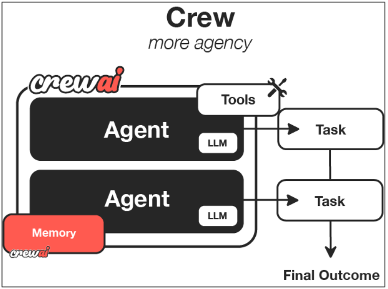

## What is CrewAI?
CrewAI is a lean, lightning-fast Python framework built entirely from scratch—completely independent of LangChain or other agent frameworks.

CrewAI empowers developers with both high-level simplicity and precise low-level control, ideal for creating autonomous AI agents tailored to any scenario:
* **CrewAI Crews**: Optimize for autonomy and collaborative intelligence, enabling you to create AI teams where each agent has specific roles, tools, and goals.
* **CrewAI Flows**: Enable granular, event-driven control, single LLM calls for precise task orchestration and supports Crews natively.

## How Crews Work
Just like a company has departments (Sales, Engineering, Marketing) working together under leadership to achieve business goals, CrewAI helps you create an organization of AI agents with specialized roles collaborating to accomplish complex tasks.

<p align="center">
  
</p>

## Installation Guide
Follow these steps to set up and run the project on your system

### **Prerequisites - UV**
Windows
```
powershell -ExecutionPolicy ByPass -c "irm https://astral.sh/uv/install.ps1 | iex"  
```
Linux/Mac
```
curl -LsSf https://astral.sh/uv/install.sh | sh 
```                                    

### **1. Clone the Repository**
```
git clone https://github.com/lintosunny/crew-ai.git
```

### **2. Create a virtual environment & install dependencies**
```
uv sync
```

### **3. Activate the Virtual Environment**
Linux/Mac
```
source .venv/bin/activate
```
windows
```
.venv\Scripts\activate 
```


### **4. Set up Environment Variables**
Create a `.env` file in the project root and add the following:
```
GEMINI_API_KEY=<your gemini api key>
SERPENT_API_KEY=<your sep api key>
```

### **5. Update the Topic**
Edit the `config/input.yaml` file and set your topic:

```yaml
input: "<enter your topic here>"
```
By default, the topic is:
```
input: "Write a blog about the present status of AI and its future after 5 years."
```

### **6. Run**
```
python crew.py
```